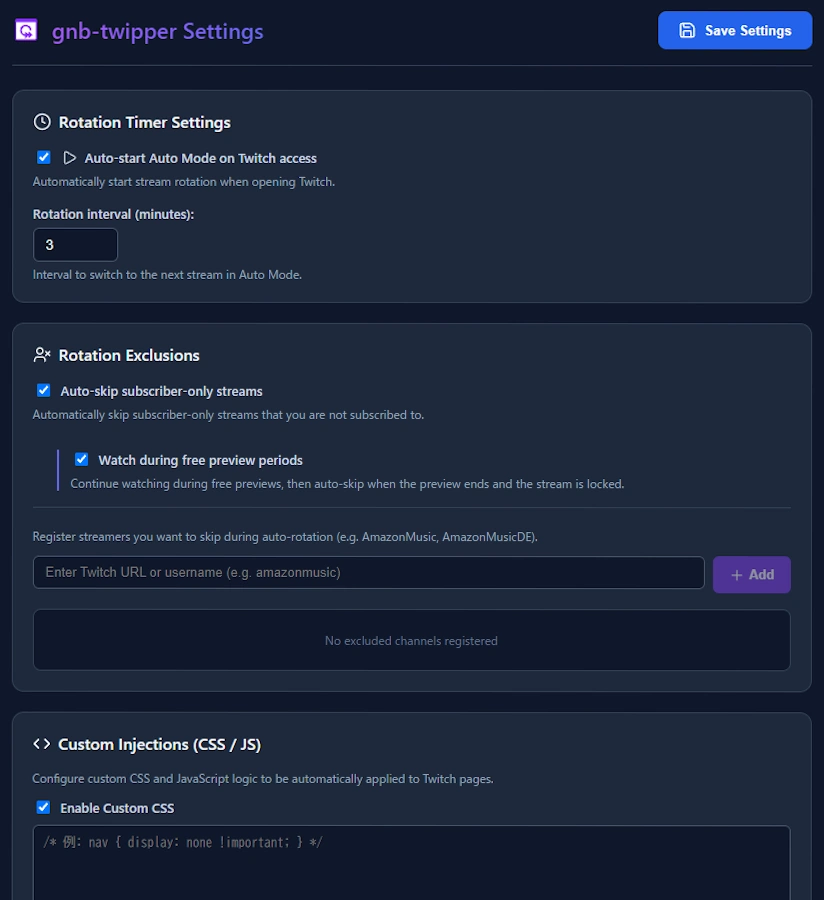

[English](./README.md) / [日本語](./README_ja.md)

# GNB Twipper for Twitch

> **A smart browser extension for auto-rotating and comfortably watching your followed Twitch channels.**  
> Perfect for keeping up with multiple favorite streamers or playing streams as background audio!  
> Call it "Twipper"!  
> 🌐 **Supported Languages**: 🇯🇵 日本語 / 🇺🇸 English / 🇪🇸 Español / 🇧🇷 Português / 🇩🇪 Deutsch / 🇫🇷 Français / 🇹🇼 繁體中文

---

## 💡 What is GNB Twipper?

`GNB Twipper` is a browser extension designed to automatically cycle through your followed live streamers on Twitch at customizable intervals.

- **No Credential Re-entry**: Operates seamlessly using your existing browser session—no manual logins, tokens, or external authentication needed.
- **Clean Browser History**: Uses in-place navigation (`location.replace`) so your browser's back-button history is never cluttered with dozens of Twitch hops.
- **Safe & Reliable**: Fully respects Twitch security policies without violating Twitch Integrity protections, automating standard browser interactions safely.

---

## ✨ Key Features

### 🔄 Smart Auto-Rotation & Standby

- **Automatic Channel Cycling**: Automatically jumps to the next live channel in your follow list at set intervals (e.g. every 3 minutes).
- **Fair Round-Robin Rotation**: Prioritizes streamers with lower cumulative watch time and newly live channels, ensuring balanced viewing across all your favorites.
- **Smart Standby**:
  - When only **1 channel** is live: Pauses rotation and continues playback seamlessly ("Standby (Single live)").
  - When another streamer goes live (2 or more): Resumes rotation automatically.
  - When **0 channels** are live: Enters standby mode ("Standby (No live)").

### 🚫 Subscriber-Only Stream Auto-Skip

- Automatically detects and skips unsubscribed "Subscriber-Only" streams.
- **Free Preview Support**: Enjoy the free preview period and automatically skip to the next streamer the moment the preview ends and the stream is locked.

### ⛔ Rotation Exclusion Management

- Register channels you want to skip (e.g. 24/7 continuous broadcasts, official music bots) into the exclusion list to keep them out of the rotation queue.

### 🖥️ Twitch-Integrated Control Bar

A sleek, compact control bar is embedded directly next to the Twitch search bar:
- **`[AUTO]`**: Toggle auto-rotation on and off with a single click.
- **`[Skip]`**: Jump immediately to the next live streamer.
- **Timer & Status Badges**: View remaining time and standby status at a glance.
- **Accordion Streamer List**: Inspect live streamers and watch progress directly from the header, or jump to any streamer instantly.

### 🎨 Custom CSS & JS Injections (Advanced & Optional)

- Dynamically inject custom CSS styling and JavaScript logic into Twitch pages.
- **Note: This configuration is completely optional and not needed for standard auto-rotation.**
- ⚠️ **JavaScript Execution Notice**: Due to browser security requirements (Manifest V3 `userScripts` API), running custom JavaScript requires enabling **"Allow user scripts"** in this extension's **Details** page via `chrome://extensions`.

---

## 📥 Installation

> **Supported Browsers**: Google Chrome, Microsoft Edge, Brave, Opera, Vivaldi, and other Chromium-based browsers.

### Chrome Web Store (Coming Soon)

One-click installation directly from the official store once published.

### Manual Installation from ZIP

1. Download the latest `chrome-extension-vX.X.X.zip` from [GitHub Releases](../../releases).
2. Extract the ZIP archive to a folder of your choice.
3. Open your browser and navigate to `chrome://extensions/`.
4. Enable **Developer mode** in the top-right corner.
5. Click **Load unpacked** in the top-left corner and select the **extracted folder**.
6. Open [Twitch](https://www.twitch.tv) and you will see the GNB Twipper controls on the top header!

> **💡 Recommended Tip**: Click the puzzle piece (Extensions) icon in the browser toolbar and **pin** `GNB Twipper` for quick access to popup controls and options at any time.

---

## 🚀 Quick Start Guide

1. **Open Twitch**: Navigate to [Twitch](https://www.twitch.tv) in your browser with your regular logged-in account.
2. **Start Rotating**:
   - Click the **`[AUTO]`** button next to the search bar (or in the extension popup).
   - The countdown timer will start, cycling through your followed live streamers.
3. **Control Playback**:
   - Click **`[Skip]`** to jump to the next stream immediately.
   - Click **`[AUTO]`** to pause rotation and stay on your current stream.

---

## ⚙️ Configuration

Open settings by clicking "Options" in the extension popup or the settings gear icon in the header bar:

| Option | Description | Default |
| :--- | :--- | :--- |
| **Rotation Interval** | Time spent on each streamer during normal rotation | 3 min |
| **Auto Start on Launch** | Automatically begin rotation when Twitch or browser opens | OFF |
| **Skip Sub-Only Streams** | Automatically skip unsubscribed subscriber-only streams | ON |
| **Allow Free Preview** | Stay on sub-only streams during the free preview period | ON |
| **Excluded Channels** | List of usernames/URLs excluded from rotation queue | None |
| **Display Language** | UI language (Japanese, English, Spanish, Portuguese, German, French, Traditional Chinese) | Browser default |
| **Custom CSS / JS** | User-defined custom styles and scripts for Twitch (Advanced) | Disabled |

---

## ❓ FAQ

### Q. Do I need to enter my Twitch username or password?

**A.** No! GNB Twipper uses your active browser session directly. Your credentials or passwords are never stored, transmitted, or requested.

### Q. Is there any risk of account bans or penalties?

**A.** No. The extension simply automates browser navigation and interacts with Twitch through standard browser requests, fully respecting Twitch's security policies.

### Q. How are audio and volume handled? (Can I keep it muted?)

**A.** Volume and mute states are maintained directly by the Twitch player. If you lower the volume or mute a stream, that setting persists throughout rotation.

### Q. Rotation stopped by itself. Why?

**A.** If only one followed channel is currently broadcasting live, the extension automatically pauses rotation and enters "Standby (Single live)" to keep playback uninterrupted. Rotation resumes automatically once another streamer goes live. Reloading the Twitch page is also helpful.

### Q. The control bar does not appear on Twitch. What should I do?

**A.** Please refresh the Twitch page (F5). If it still does not appear, verify that the extension is enabled at `chrome://extensions/`.

---

## 💬 Feedback & Inquiries

- **Homepage & Source Code**: [GitHub Repository](https://github.com/GennoBou/gnb-twipper)
- **Bug Reports & Suggestions**: Please submit issues to [GitHub Issues](https://github.com/GennoBou/gnb-twipper/issues).
- **A Note on Languages from the Author**:
  > The author is a native Japanese speaker with limited English proficiency.  
  > Issues and inquiries in English or any other supported language are very welcome! Replies will be prepared with the help of translation tools.  
  > Community pull requests, bug fixes, and translation improvements are always warmly appreciated.

---

## 📄 Documentation & Policies

- 🔒 [Privacy Policy](./docs/PRIVACY_POLICY.md) ([日本語版](./docs/PRIVACY_POLICY_ja.md))
- 🌐 [Store Listing Specifications](./docs/STORE_LISTING.md) ([日本語版](./docs/STORE_LISTING_ja.md))

---

## 🛠️ Developer & Contributor Resources

For building from source, architecture design, and contribution guidelines:

- **Developer Guide**: [docs/DEVELOPMENT_ja.md](./docs/DEVELOPMENT_ja.md) (Build, test, debug setup)
- **Architecture Design**: [docs/ARCHITECTURE_ja.md](./docs/ARCHITECTURE_ja.md) (Hybrid GQL/DOM, state management)
- **Master Specification**: [AGENT.md](./AGENT.md) (Repository design principles & components)
- **Deployment Guide**: [docs/DEPLOYMENT_GUIDE.md](./docs/DEPLOYMENT_GUIDE.md) ([日本語版](./docs/DEPLOYMENT_GUIDE_ja.md))

---

## 📜 License

This project is licensed under the [MIT License](./LICENSE).  
© 2026 GennoBou
