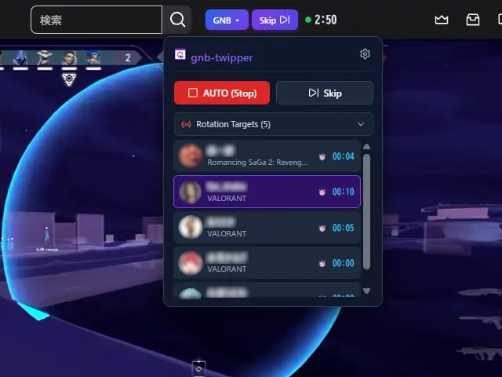
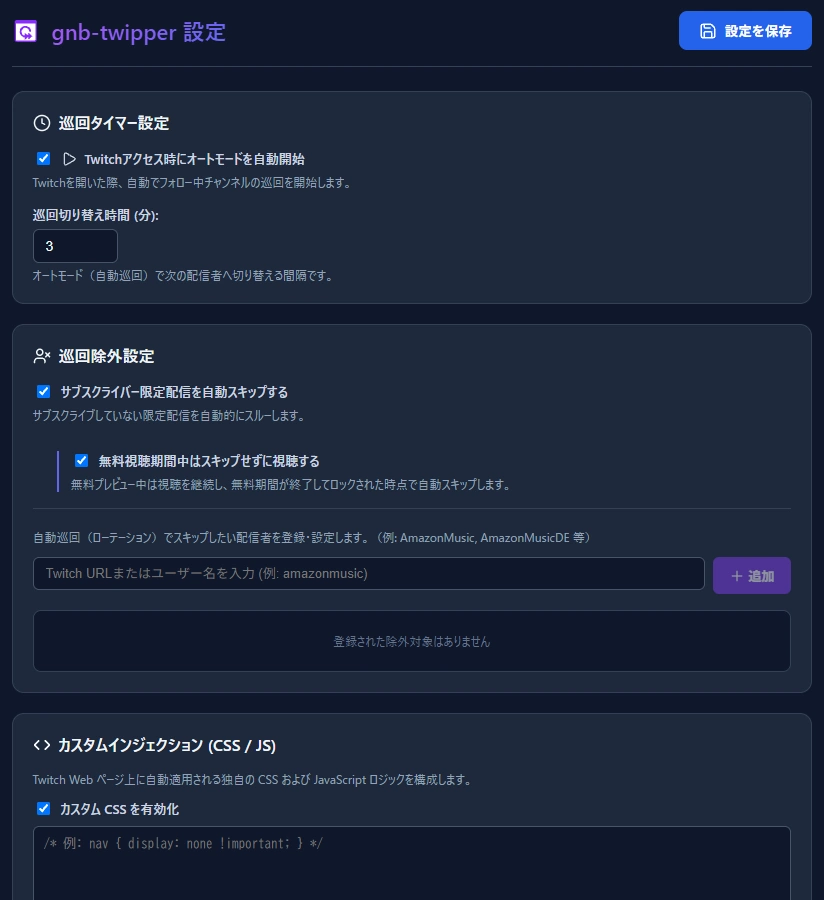

[English](./README.md) / [日本語](./README_ja.md)

# GNB Twipper for Twitch

> **Twitchのフォロー中チャンネルを自動巡回・快適視聴できるブラウザ拡張機能**  
> 推しの配信をまんべんなく見守りたい方、作業用BGMとして流し見したい方に最適です。  
> ツゥィッパーと呼んでね！  
> 🌐 **対応言語**: 🇯🇵 日本語 / 🇺🇸 English / 🇪🇸 Español / 🇧🇷 Português / 🇩🇪 Deutsch / 🇫🇷 Français / 🇹🇼 繁體中文  

---

## 💡 GNB Twipper とは？

`GNB Twipper` は、Twitch でフォローしているライブ配信者を一定時間ごとに自動で切り替えて巡回・視聴するためのブラウザ拡張機能です。

- **ログイン情報の再入力は不要**: 普段お使いのブラウザセッションをそのまま利用するため、アカウント連携やパスワード入力は一切不要です。
- **ブラウザ履歴が汚れない**: ページ遷移時に履歴を増やさず上書き遷移（`location.replace`）を行うため、ブラウザの「戻る」ボタンが巡回履歴で埋まりません。
- **安全な動作**: Twitch のセキュリティポリシーに違反せず、通常のブラウザ操作と同じ安全な仕組みで動作します。

---

## ✨ 主な機能

### 🔄 スマート自動巡回（オートモード）

- **一定間隔で自動切り替え**: 設定した時間（例: 3分）ごとに、ライブ配信中のチャンネルを順次切り替えます。
- **偏りのない均等ローテーション**: 累積視聴時間が少ない配信者や新しく配信を始めた枠を優先的に巡回するため、特定の配信者に偏らずまんべんなく見守れます。
- **スマート待機機能**:
  - 配信者が1人のみの場合: 自動切り替えをストップし、そのまま視聴を継続します（「待機中 (1人のみ)」）。
  - 他の配信者がライブを開始（2人以上）: 自動的に巡回を再開します。
  - 配信者が0人の場合: 「待機中 (配信なし)」として待機します。

### 🚫 サブスク限定配信の自動スキップ

- 未加入の「サブスクライバー限定配信」を自動検知してスキップします。
- **無料プレビュー対応**: 無料プレビュー期間中はそのまま視聴を継続し、無料枠が終了して画面がロックされた瞬間に次へスキップする設定も可能です。

### ⛔ 巡回除外チャンネル設定

- 24時間配信チャンネル、公式音楽配信、巡回したくない配信者などを除外リストに登録し、巡回キューから安全に除外できます。

### 🖥️ Twitch 画面に溶け込む専用操作バー

Twitch の画面上部（検索バーの横）にコンパクトな操作バーが自動で埋め込まれます。

- **`[AUTO]`**: ワンクリックで自動巡回の開始・一時停止を切り替え。
- **`[スキップ]`**: 今の配信を飛ばして次の配信者へ即座にジャンプ。
- **タイマー＆ステータス**: 次の巡回までの残り時間や現在の待機ステータスを表示。
- **配信者リスト**: 巡回対象の配信者一覧と視聴進捗をその場で確認・直接切り替え。

### 🎨 カスタム CSS / JS インジェクション（上級者向け・任意）

**※通常の自動巡回機能を使う場合、本設定は一切不要です。**

- Twitch ページ上にユーザー独自の CSS スタイルや JavaScript ロジックを動的に適用できます。
- ⚠️ **JavaScript 実行に関する注意**: ブラウザのセキュリティ仕様（Manifest V3 `userScripts` API）により、カスタム JavaScript を実行するには、ブラウザの拡張機能管理ページ（`chrome://extensions`）で本拡張機能の「詳細」を開き、「ユーザースクリプトを許可する」を ON に設定する必要があります。

---

## 📥 インストール方法

> **対応ブラウザ**: Google Chrome、Microsoft Edge、Brave、Opera、Vivaldi などの Chromium 系ブラウザ

### Chrome ウェブストア（準備中）

ストア公開後はワンクリックでインストールできるようになります。

### ZIP ファイルから手動でインストールする場合

1. [GitHub Releases](../../releases) から最新の `chrome-extension-vX.X.X.zip` をダウンロードします。
2. ダウンロードした ZIP ファイルを任意のフォルダに解凍します。
3. ブラウザを開き、アドレスバーに `chrome://extensions/` と入力して開きます。
4. 画面右上の **「デベロッパーモード」** を ON にします。
5. 左上の **「パッケージ化されていない拡張機能を読み込む」** をクリックし、**解凍してできたフォルダ** を選択します。
6. [Twitch](https://www.twitch.tv) にアクセスすると、画面上部に GNB Twipper の操作ボタンが表示されます。

> **💡 おすすめのTips**: ブラウザ右上にある「パズルピース（拡張機能）」アイコンをクリックし、`GNB Twipper` を**ピン留め**しておくと、ツールバーからいつでもワンクリックで操作・設定画面を開けて便利です。

---

## 🚀 使い方ガイド

1. **Twitch を開く**: 普段お使いのアカウントでログイン済みのブラウザで [Twitch](https://www.twitch.tv) を開きます。
2. **巡回を始める**:
   - 画面上部検索バー横の **`[AUTO]`** ボタン、または拡張機能アイコンのポップアップから「オート巡回開始」を押します。
   - タイマーのカウントダウンが始まり、フォロー中のライブ配信者を自動巡回します。
3. **操作する**:
   - 次の配信者へすぐに移動したいときは **`[スキップ]`** を押します。
   - 気に入った配信を一時的に見続けたいときは **`[AUTO]`** を押して一時停止できます。

---

## ⚙️ 設定項目

拡張機能アイコンをクリックして「詳細設定」を開くか、操作バーの歯車アイコンから各種カスタマイズが可能です。

| 設定項目 | 説明 | デフォルト |
| :--- | :--- | :--- |
| **巡回切り替え時間** | 通常巡回時に次の配信者へ切り替えるまでの時間（分） | 3分 |
| **起動時オート開始** | Twitch/ブラウザ起動時に自動で巡回を開始するかどうか | OFF |
| **サブスク限定スキップ** | 未加入のサブスク限定配信を自動的にスキップするかどうか | ON |
| **無料プレビュー視聴** | サブスク限定配信の無料視聴期間中はスキップせず視聴を続けるか | ON |
| **巡回除外チャンネル** | 巡回対象から除外したいユーザーIDやURLを登録 | なし |
| **表示言語** | UI の表示言語（日本語、English、Español、Português、Deutsch、Français、繁體中文） | ブラウザ準拠 |
| **カスタム CSS / JS** | Twitch ページに適用する独自スタイル・スクリプト（上級者向け） | 無効 |

---

## ❓ よくある質問 (FAQ)

### Q. Twitch のユーザー名やパスワードを新たに入力する必要がありますか？

**A.** 不要です。お使いのブラウザで既にログインしているセッション情報をそのまま利用します。

### Q. アカウントが BAN されたりペナルティを受けたりしませんか？

**A.** 通常のブラウザ閲覧と同じ手順で配信ページを開いて視聴するため、Twitch のセキュリティポリシーに違反しません。通常のユーザー操作を自動化しているだけですので、安心してお使いいただけます。

### Q. 音声や音量はどうなりますか？（ミュートのまま回せますか？）

**A.** Twitch プレイヤー側の音量やミュート設定がそのまま引き継がれます。作業用BGMとして小さな音にしておけば、巡回中もその音量で維持されます。

### Q. 巡回が途中で止まってしまいました

**A.** ライブ配信中のフォロー中チャンネルが1人のみの場合、自動巡回は一時停止して「待機中 (1人のみ)」になります。他の配信者がライブを開始すると自動で巡回が再開されます。一度Twitchのページを再読込するのが有効です。

### Q. Twitch 画面に操作バーが表示されません

**A.** Twitch のページを一度再読み込み（F5）してください。それでも表示されない場合は、`chrome://extensions/` で拡張機能が有効になっているかご確認ください。

---

## 💬 フィードバック・お問い合わせ

- **公式ページ・リポジトリ**: [GitHub リポジトリ](https://github.com/GennoBou/gnb-twipper)
- **バグ報告・機能要望**: [GitHub Issues](https://github.com/GennoBou/gnb-twipper/issues) よりお気軽にご投稿ください。
- **作者からの言語についてのお知らせ**:
  > 作者は日本語を母国語としており、英語は少ししかできません。  
  > 英語やその他の言語での Issue 投稿も大歓迎です（AI・翻訳ツールを活用して返信いたします）。  
  > コミュニティからの Pull Request や翻訳の改善提案も心よりお待ちしております！

---

## 📄 ドキュメント & 規約

- 🔒 [プライバシーポリシー](./docs/PRIVACY_POLICY_ja.md) ([English Edition](./docs/PRIVACY_POLICY.md))
- 🌐 [ストア掲載情報](./docs/STORE_LISTING_ja.md) ([English Edition](./docs/STORE_LISTING.md))

---

## 🛠️ 開発者・コントリビューター向け情報

当リポジトリのソースコードビルド、アーキテクチャ設計、開発規約については以下の各ドキュメントをご参照ください。

- **開発・ビルド手順**: [docs/DEVELOPMENT_ja.md](./docs/DEVELOPMENT_ja.md) (環境構築・ビルド・デバッグ)
- **内部設計・アーキテクチャ**: [docs/ARCHITECTURE_ja.md](./docs/ARCHITECTURE_ja.md) (GQL/DOMハイブリッド取得・状態管理)
- **プロジェクト総合仕様書**: [AGENT.md](./AGENT.md) (全体の設計思想・コンポーネント構成)
- **デプロイ・公開ガイド**: [docs/DEPLOYMENT_GUIDE_ja.md](./docs/DEPLOYMENT_GUIDE_ja.md)

---

## 📜 ライセンス

本プロジェクトは [MIT License](./LICENSE) のもとで公開されています。  
© 2026 GennoBou
